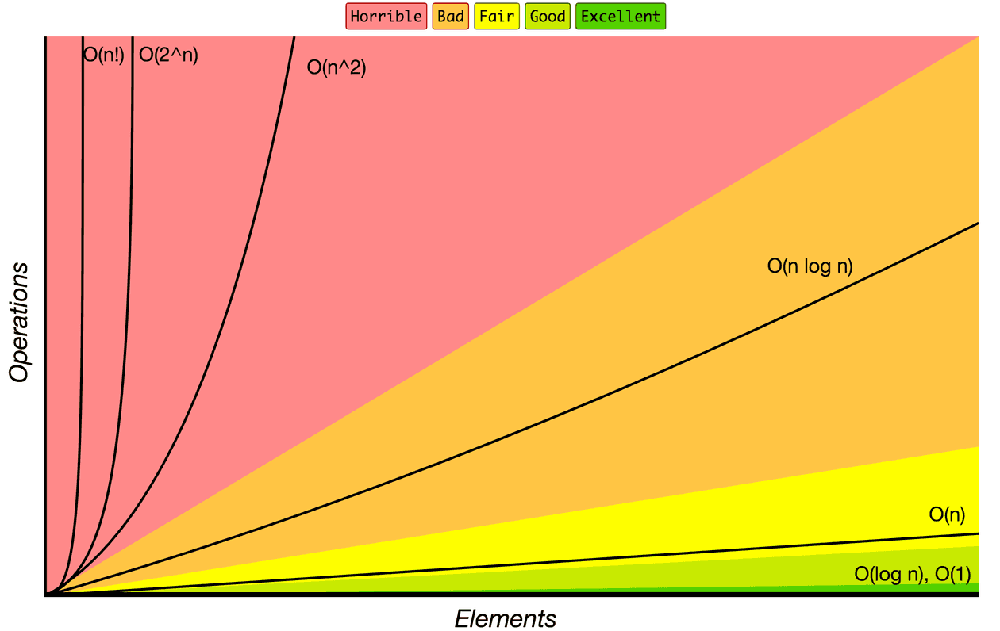

# Leetcode diary 📅
<!-- 

 -->

<p align="left">
  
  
  
  <!--  -->
</p>

* Forgetting Go 😕
* Training Python 🥱
* Picking up Java 🥹
* Drown by C++ 🫠
* Is JavaScript the best programming language to become a full-stack developer 🤔


<br><br>


# 💡 Have fun!
* [Python3 template and tricks 🤫](./lc_Python/template_trick.py)
* [Weekly contest tool 🔥](./lc_Python/contest/)
* [Try it at here 🔬](https://leetcode.com/problems/find-positive-integer-solution-for-a-given-equation/): `print(inspect.getsource(customfunction.__class__))`
* Typically:
  * Java is most likely to AC a problem with brute force 🙃.
  * Python can AC many string-related problems with time complexity that cannot be passed 😅.
  * You can import any Go library, the download time won't be counted in the testing time 😈.


<br><br>


# 🔗
[OI Wiki](https://oi-wiki.org/)  

[clist.by](https://clist.by/) 

[Algorithms for Competitive Programming (translate from http://e-maxx.ru/algo/)](https://cp-algorithms.com/index.html)

[Markdown](https://markdown.com.cn)

[GeeksforGeeks](https://www.geeksforgeeks.org/)

[Contest rating predictor](https://lccn.lbao.site/)

[LCCN - Medal and achievement rules](https://leetcode.cn/circle/discuss/0fKGDu/) 

[LCCN - Weekly contest rating algorithm](https://leetcode.cn/circle/article/neTUV4/) 

[LCUS - Weekly contest rating algorithm](https://leetcode.com/discuss/general-discussion/468851/New-Contest-Rating-Algorithm-(Coming-Soon))

[LCCN - Barrier of badge](https://leetcode.cn/circle/discuss/6gnvEj/view/WbN5TH/) 

[LCCN - Histroy of Guardian / Knight score](https://leetcode.cn/circle/discuss/SKzRis/) 


<br><br>


# 📚: 
isbn: 978-7-83009-313-6


<br><br>


# Python3:

* [PEP 8 – Style Guide for Python Code](https://peps.python.org/pep-0008/)

* `math.lcm(*integers)`, [New in version 3.9](https://docs.python.org/3/library/math.html#math.lcm), If any of the arguments is zero, then the returned value is 0. lcm() without arguments returns 1.

* `@functools.cache(user_function)`, [New in version 3.9](https://docs.python.org/3/library/functools.html#functools.cache), Returns the same as lru_cache(maxsize=None).

* `int.bit_count()`, [New in version 3.10](https://docs.python.org/3/library/stdtypes.html#int.bit_count), Equivalent to: `bin(self).count("1")`.

* `itertools.pairwise(iterable)`, [New in version 3.10](https://docs.python.org/3/library/itertools.html#itertools.pairwise), list(pairwise('a')) -> [], list(pairwise('abc')) -> [('ab', 'bc')].

* `itertools.accumulate(iterable[, func, *, initial=None])`, [Changed in version 3.8](https://docs.python.org/3/library/itertools.html#itertools.accumulate), if the keyword argument `initial` is provided, the output has one more element than the input iterable. See [`functools.reduce()`](https://docs.python.org/3/library/functools.html#functools.reduce) for a similar function that returns only the FINAL accumulated value.

* `collections.Counter(a) > collections.Counter(b)`, [New in version 3.10](https://docs.python.org/3/library/collections.html#collections.Counter), All of those tests treat missing elements as having zero counts so that Counter(a=1) == Counter(a=1, b=0) returns true.

* `c = Counter(a=3, b=1); d = Counter(a=1, b=2); # c - d -> Counter({'a': 2})`, [New in version 3.10](https://docs.python.org/3/library/collections.html#collections.Counter), Counter() subtract **ONLY** keep positive counts. if we want to include negative values, use `obj1.subtract(obj2)`.

* `x != y != z` behaves as `x != y and y != z`, instead of `x != b and x != z and b != z`, so `x < y > z` is possible, [6.10. Comparisons](https://docs.python.org/3/reference/expressions.html#comparisons).

* quotes in type hint, `def lca(root: 'TreeNode')`, [PEP 484](https://peps.python.org/pep-0484/#forward-references).

* Type aliases, [New in version 3.10](https://docs.python.org/3/library/typing.html#typing.TypeAlias). Like `type null = None` will cause `Type alias statement requires Python 3.12 or newer`. [PEP 613](https://peps.python.org/pep-0613/). How to deal with it in Py 3.8? Use `typing_extension.TypeAlias`. [typing-extensions - PyPI](https://pypi.org/project/typing-extensions/)

* `NoneType`
  * In Python 2.7, `NoneType` is a type defined in the [standard library module types](https://docs.python.org/2/library/types.html#types.NoneType)
  * In Python 3.0 to 3.9, `NoneType` has been [removed](https://bugs.python.org/issue19438) from module `types`, presumably because there is only a single value of this type. It effectively exists nevertheless, it only has no built-in name: You can access NoneType by writing `type(None)`.
  * In Python 3.10+, `NoneType` is again a type defined in the [standard library module **`types`**](https://docs.python.org/3.10/library/types.html#types.NoneType), introduced in order to [help type checkers do their work](https://docs.python.org/3.10/whatsnew/3.10.html#types)

* [Python Glossary](https://docs.python.org/3/glossary.html).


<br><br>


# Java:

* [`var`](https://openjdk.org/projects/amber/guides/lvti-style-guide):
  * Java SE 10 introduced [type inference for local variables](https://openjdk.org/jeps/286). With type inference, the explicit type can be replaced by the reserved type name var for local variable declarations that have initializers.
  * You can use `var` only for local variables (in methods). It cannot be used for instance variables (at class level).
  * cannot use `var` in Lambda expressions.
  * cannot use `var` for method signatures (in return types and parameters).
  * cannot use it with a generic type.
* `x += s.charAt(i) - 'a';` is much faster than `x += s.charAt(i) == 'b' ? 1 : 0;`
* `System.arraycopy` vs `Arrays.copyOf`
  * `native` keyword shows that `System.arraycopy` is implemented by other languages like C/C++ (fast)
  * `Arrays.copyOf` will create a new item. `System.arraycopy` only copy from src to dst.
  * `Arrays.copyOf` will call `System.arraycopy`, so it is a bit slow. 
* `static`
  * when we declare a field static, exactly a single copy of that field is created and shared among all instances of that class (access static fields without object initialization!)
  * static variables are stored in the heap memory (fast)

<br><br>


# Big O
The O is short for “Order of”. If we’re discussing an algorithm with O(n), we say its **order of**, or **rate of growth**, is n, or linear complexity.

| O            | Complexity  |
| ------------ | ----------- |
| O(1)         | constant    |
| O(log n)     | logarithmic |
| O(n)         | linear      |
| O(n * log n) | log linear  |
| O(n^2)       | quadratic   |
| O(n^3)       | cubic       |
| O(2^n)       | exponential |
| O(n!)        | factorial   |

<details>
<summary>Show Picture</summary>
 
</details>


<br><br>


# Dynamic Programming

* **Memoization** and **Tabulation**
  - Tabulation(Bottom Up)(刷表)
  - Memoization(Top Down)
* Difference:


<br><br>


# :arrow_forward:
[推荐观看 0x3f 的b站](https://space.bilibili.com/206214)


<br><br>


# :shipit:
大佬们的经验之谈:

[🍭可乐可乐吗QAQ](https://leetcode.cn/circle/discuss/PDJMWs/)

[mumuxinfie](https://leetcode.cn/circle/discuss/nv1nBg/)


<br><br>

# :seven::seven::eight::eight:
* MOD:
  * **不取余python超时**
  * dp中有减法, 负数 x 取余, 防止变一个大数: `(x + MOD) % MOD`
  * 区别: 
    * 取余(rem): 采用fix(), 向 0 方向舍入, `rem(x, y) = x - y. * fix(x./y)`
    * 取模(mod): 采用floor(), 向无穷小方向舍入, `mod(x, y) = x - y. * floor(x./y)`
    * 取模和求余应该是同一种运算, 只是在被除数和除数符号不同时, 余数的符号是有歧义的, 可为正也可为负
      * C, Go, JavaScript, Rust, Java, Swift, PHP中结果与被除数同符号
      * Python 中结果与除数同符号

* 精度:
  * 32 位整数开方的整数部分是准确的
  * 64 位开方可能得到类似 xxx.9999999 的结果

* 回溯:
  * 两重for循环, 内层for break之后, 回溯"路径"被打断了, 不能复原到初始状态

* python堆 / heapq / 堆不保证直接list的顺序
  ```py
    # 不断push tuple 到堆中
    0 [(5, 0)]
    0 [(5, 0), (5, 0)]
    1 [(4, 1), (5, 0), (5, 0)]
    2 [(3, 2), (4, 1), (5, 0), (5, 0)]
    3 [(2, 3), (3, 2), (5, 0), (5, 0), (4, 1)]
    3 [(2, 3), (3, 2), (2, 3), (5, 0), (4, 1), (5, 0)]
    4 [(1, 4), (3, 2), (2, 3), (5, 0), (4, 1), (5, 0), (2, 3)]
    7 [(1, 4), (2, 7), (2, 3), (3, 2), (4, 1), (5, 0), (2, 3), (5, 0)]
    7 [(1, 4), (2, 7), (2, 3), (2, 7), (4, 1), (5, 0), (2, 3), (5, 0), (3, 2)]
    ```

* XOR (exclusive OR)
  * 半加运算，不带进位的二进制加法
    * 与0异或 = 本身
    * 与1异或 = 取反 -> 翻转特定位
      * 翻转10100001的第2位和第3位 -> 10100001 ^ 00000110 = 10100111
    * 异或自己 = 置0
      * a ^ b ^ a = b (^ caret)
  
* 位运算(整数在计算机中是以补码的形式储存的)
  * 求整数二进制的最低位1
    1. `n & (-n)`: 任何整数，其二进制表示的最后一个'1'，可由该整数与其相反数按位取与得到
    2. `n & (n-1)`: 二进制数字 n 最右边的 1 变成 0, 其余不变, 消去二进制数中的最低位'1', Why: 'n-1'会一直向前寻找可借的位，从而跳过低位连续的'0'，而向最低位的'1'借位，借位后最低位的'1'变为'0'，原先最低位'1'的下一位从'0'变为'1'，其余位都不变，相与之后其它位不变
    3. `n > 0 && n & (n - 1) == 0` 判断是否是'2'的幂
    4. ```c
        upper, lower exchange: asc ^= 32
        upper, lower to lower: asc |= 32
        lower, upper to upper: asc &= -33
        ```

* Py Fast Reader
  ```py
  # cf 快读
  fn = sys.stdin.readline
  l = int(fn())
  for _ in range(l):
    n = int(fn())
    h = list(map(int, fn().split()))
  ```
