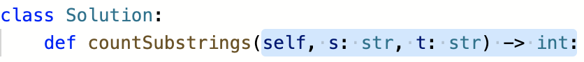
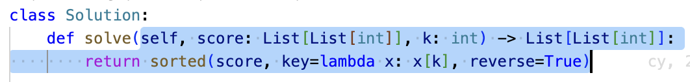
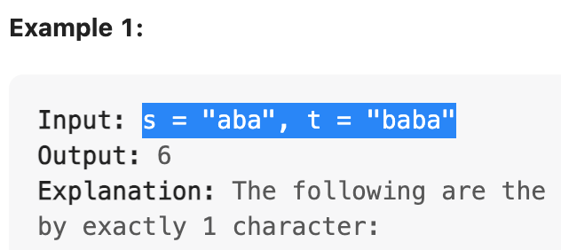

# Step 1 
<details>
<summary>Copy a part of the new function definition and overwrite the old "blue" part.</summary>
<br>
<p>From a new problem</p>

<p>To one of template file</p> 
 
</details>
<br>

# Step2
<details>
<summary>Copy test cases and overwrite old ones</summary>
<br>

</details>
<br>

# Step3
```sh
# cd to "/contest" and try to run a solution
cd ./leetcode/lc_Python/contest
# run problem 1
./run 1
# run problem 2, etc.
./run 2
# ...

# revert to the original template
./run flush
```